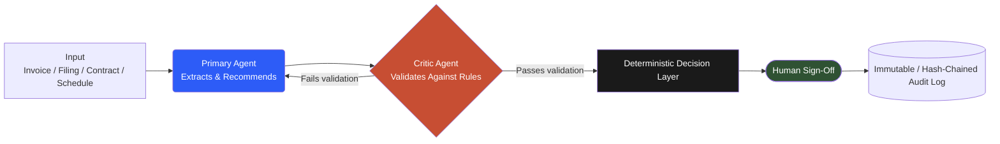

# Jay Patel
### AI Governance & Agentic Finance Automation

**The model recommends. Deterministic code decides. A human signs off.**

[Portfolio](https://jpatel.io) · [LinkedIn](https://linkedin.com/in/jpatel-strategy) · jayp382001@gmail.com

---

## The Standard

An AI agent doesn't get to move money, approve an invoice, or overwrite a governing
contract clause just because it sounds confident. Every system below follows the
same architecture: a **Primary Agent** extracts and recommends, a **Critic Agent**
validates that recommendation against deterministic rules, and nothing reaches
production state until a **human signs off** — with every step written to a log
nobody, including me, can quietly edit after the fact.

## Architecture Pattern

This isn't one project's diagram — it's the constraint every project below is built inside.

## Live Systems

| Project | What it governs | Verified result |
|---|---|---|
| **[ReconcileAI](https://github.com/jpatel-strategy/reconcileai)** | Month-end close reconciliation | 97.5% automated match rate · 40+ hrs saved/cycle · 100% audit coverage |
| **[AuditLedger](https://github.com/jpatel-strategy/auditledger)** | AP 3-way match & chargeback | 100% error detection, 0 false auto-approvals · 60% straight-through |
| **[StratBrief AI](https://github.com/jpatel-strategy/StratBrief-AI)** | SEC filing → board memo | Zero numeric drift · full paragraph-level citation across 5 tickers |
| **[ClauseKinetic](https://github.com/jpatel-strategy/supply-chain-)** | Contract precedence & chargeback exception | Amendment-precedence engine · 2 production security gaps closed pre-launch · adversarially chaos-tested before shipping |
| **[ShiftProof AI (Rostrix)](https://shift-proof-ai.vercel.app)** | Staffing & scheduling resilience | 528,000-run Monte Carlo stress test · self-audits and labels every output MEASURED, ESTIMATED, or ASSUMPTION |

## Governance Credentials

`NIST AI RMF 1.0` · `Bloomberg Market Concepts` · `IAPP AIGP (in progress)` · `Lean Six Sigma Green Belt (in progress)`

## Stack

`Python` `LangChain / RAG` `SQL` `Streamlit` `Azure AI` `PostgreSQL` `FastAPI`
